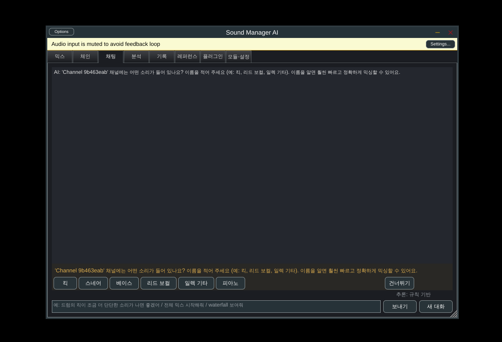
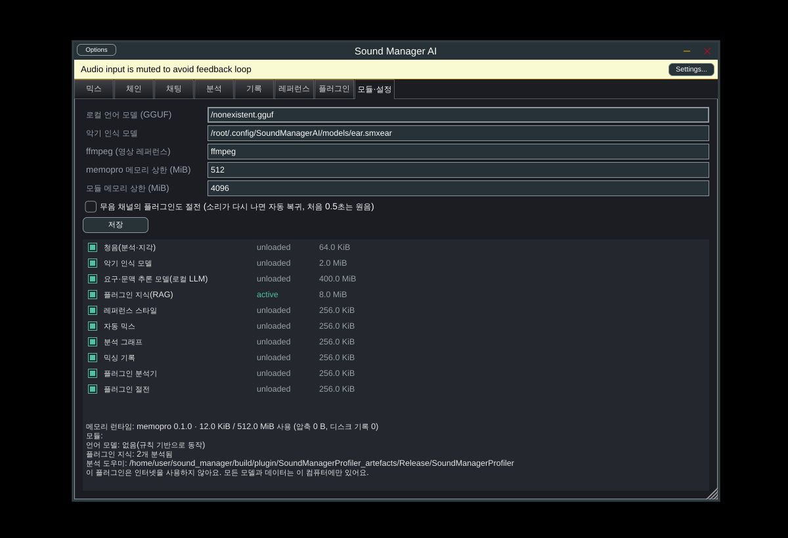

# Sound Manager AI

DAW의 트랙·버스·마스터 채널에 넣어 쓰는 **완전 로컬 AI 믹싱 플러그인**입니다.
인터넷도 서버도 쓰지 않습니다. 사용자가 허용한 **자신의 플러그인만** 가지고 AI가 채널 소리를 듣고, 플러그인 순서를 계획하고, 값과 볼륨 밸런스를 조절합니다.
"드럼의 킥이 조금 더 단단한 소리가 나면 좋겠어" 같은 채팅 요청은 로컬 언어 모델이 이해합니다. 모델 파일이 없으면 규칙 기반으로 이해합니다.
메모리는 [memopro](https://github.com/imhyensuk/memopro) 런타임이 하나의 상한 안에서 관리합니다.

| 채팅: 이름을 묻는 질문 | 모듈·메모리 |
|---|---|
|  |  |

## 요구사항별 구현

| # | 요구사항 | 구현 |
|---|---|---|
| 1 | 완전 로컬 | 네트워크 코드가 없습니다(JUCE `USE_CURL=0`, 웹뷰 없음, curl·SSL 미링크). 언어 모델은 llama.cpp(GGUF), 악기 인식은 자체 MLP, 플러그인 지식은 로컬 BM25 검색입니다. 영상 레퍼런스는 PC에 설치된 ffmpeg로만 읽습니다. |
| 2 | 레퍼런스 스타일 믹싱 | **레퍼런스** 탭에 음원(wav/aiff/flac/mp3/ogg, macOS·Windows는 m4a/mp4/mov도)이나 영상을 올립니다. 파일 전체를 메모리에 올리지 않고 조각 단위로 분석합니다(1/3옥타브 톤, LUFS·LRA, PLR, 크레스트, 대역별 스테레오 폭, 트랜지언트). 결과는 마스터/버스 매칭(EQ, 압축, 리미터, 폭)과 악기별 기본 스타일로 쓰입니다. 내 곡의 멀티트랙과 완성 믹스로 학습한 **장르 프로필**(예: CCM)이 있으면 악기별 밸런스, 톤 기준, 기본 레퍼런스가 그 장르를 따릅니다. |
| 3 | memopro로 메모리 최적화 | memopro C ABI(Rust)를 정적 링크했습니다. 지식 베이스, 믹스 기록(플러그인 상태 전체), 절전 중인 플러그인 상태, 악기 인식 모델 가중치(파일 버퍼), 언어 모델의 프롬프트 KV 캐시가 **하나의 하드 상한** 안에 들어가고, 부족하면 무손실 압축하거나 파일에서 다시 읽습니다. 디스크 스왑은 없습니다. 무거운 모듈은 프로세스당 하나만 있으며, 채널 수가 많아도 인스턴스 하나는 수백 KB 수준입니다. |
| 4 | 로컬 플러그인 전부 학습 + RAG | **플러그인** 탭 → *모든 플러그인 분석·학습*. 별도 프로세스(`SoundManagerProfiler`)가 각 플러그인에 핑크 노이즈·드럼 히트·임펄스·사인 신호를 보내 파라미터별 실제 효과를 측정합니다(대역별 dB 변화, 레벨, 압축, 폭, 잔향, 왜곡). 이름이 "Param 12"여도 무엇을 하는지 알 수 있고, 진짜 종류도 판별합니다. 결과는 지식 베이스(한국어 음절 바이그램 + 영어 BM25)에 저장되어 LLM 문맥(RAG)으로 쓰입니다. 플러그인이 크래시해도 DAW는 안전하며, 진행률과 남은 시간을 표시합니다. |
| 5 | 채팅 믹싱 | 대화형 어시스턴트(`MixAssistant`)가 별도 스레드에서 동작합니다. |
| 6 | 분석 그래프 | **분석** 탭에서 RTA(피크 홀드), Hz 워터폴, 볼륨 미터(피크/RMS/모멘터리/숏텀 LUFS), 라우드니스 기록, 위상 상관을 볼 수 있습니다. 채팅으로 "waterfall 보여줘"라고 하면 바로 열립니다. 그래프 데이터는 창이 보일 때만 계산됩니다. |
| 7 | 모듈 on/off | `ModuleManager`가 모듈을 필요할 때만 불러오고, 쉬면 내리고, 메모리 상한을 넘으면 가장 오래 쉰 모듈부터 내립니다. 사용자는 모듈마다 끌 수 있습니다. 30초 넘게 바이패스된 호스팅 플러그인은 **절전**합니다: 상태를 memopro에 두고 플러그인을 메모리에서 내렸다가, 다시 켜면 그대로 돌아옵니다. 무음 채널 절전은 선택입니다. |
| 8 | 기능별 모듈화 | 청음(분석·지각), 악기 인식 모델, 요구·문맥 추론(LLM), 플러그인 지식, 레퍼런스 스타일, 자동 믹스, 분석 그래프, 기록, 분석기, 절전이 각각 모듈입니다. |
| 9 | 예상 소요 시간 | 플러그인 분석, 레퍼런스 분석, 모델 로딩, 응답 생성에 남은 시간을 표시합니다. 사전값에 실제 측정 속도를 섞어 추정합니다(`ProgressEstimator`). |
| 10 | 믹싱 전 스타일 질문 | "전체 믹스 시작해줘"라고 하면 채널마다 "보컬을 어떤 스타일로?"라고 묻고 선택지 버튼을 보여줍니다. 25초 동안 답이 없거나 *건너뛰기*를 누르면 **AI 기본 스타일**로 진행합니다. 레퍼런스가 있으면 기본 스타일이 레퍼런스를 따릅니다. |
| 11 | 기록과 되돌리기 | AI가 바꿀 때마다 스냅샷을 남깁니다(파라미터 값 + 중복 제거된 플러그인 상태). **기록** 탭에서 원하는 시점으로 되돌리거나 "되돌려줘"라고 말하면 됩니다. 기록은 각 채널의 프로젝트 상태에도 저장됩니다. |
| 12 | 채널 이름 요청 | 이름이 "Audio 3"처럼 의미 없으면 믹스 탭 상단과 채팅에서 이름을 묻습니다. 악기 인식 모델이 3초를 듣고 이름 후보 버튼을 제안합니다. |
| 13 | 능동형 모델 | 모호한 요청에는 되묻습니다. 바꾼 뒤 4초 후 다시 들어보고, 목표만큼 안 바뀌었으면 한 단계 더 조정합니다. 그다음 "어떠세요?"(좋아요/더/덜/되돌리기)라고 묻고, 답에 따라 계획을 바꿉니다. |
| 14 | 보호(수정 금지) | 채널(*이 채널 보호*)이나 플러그인(체인 탭 *보호*)을 지정하면 AI가 수정하지 않습니다. 수정이 필요하다고 판단하면 "Lead Vox의 Pro-Q › Band 2 Gain을 -2 dB 만큼 직접 바꿔 주세요 (이유: …)"처럼 사용자에게 요청합니다. |

## 구조

```
 DAW 채널마다 ──▶ [ Sound Manager 인스턴스: 가벼움 ]
                  입력 → 사용자의 플러그인(AI가 순서·값 결정, 절전 가능) → AI 게인 → 청음(분석기) → 출력
                                      ▲ 검증된 MixAction                       │ 특징·지각
                  SessionHub (같은 DAW 안 인스턴스 연결: 범위 규칙, 기록, 자동 믹스, 절전)
                                      ▲
 프로세스에 하나 ─▶ Engine: memopro 메모리 런타임 · ModuleManager
                    ├ 요구·문맥 추론: llama.cpp GGUF (문법 제약 JSON, KV 캐시를 memopro에 보관)
                    ├ 플러그인 지식(RAG) ◀── SoundManagerProfiler (별도 프로세스, 크래시 격리)
                    ├ 악기 인식 MLP (가중치 = memopro 파일 버퍼)
                    └ 레퍼런스 분석 (JUCE 디코더 / 로컬 ffmpeg, 스트리밍)
 인스턴스마다 ───▶ AssistantWorker (MixAssistant: 질문·검증·피드백, 메시지 스레드로 마샬링)
```

자세한 설계는 [docs/ARCHITECTURE.md](docs/ARCHITECTURE.md)에 있습니다.

## 사용 방법

1. 믹싱할 트랙, 버스, 마스터에 Sound Manager AI를 넣습니다. 이름 없는 채널은 이름을 알려 주세요.
2. **플러그인** 탭에서 스캔 → AI가 써도 되는 플러그인 체크 → *모든 플러그인 분석·학습*을 누릅니다. 한 번이면 되고, 플러그인 하나에 10초 안팎 걸립니다.
3. (선택) **레퍼런스** 탭에 원하는 스타일의 곡이나 영상을 올리고 *이 프로젝트의 레퍼런스로 선택*을 누릅니다.
4. 마스터 인스턴스의 **채팅**에서 요청합니다.
   - "전체 믹스 시작해줘"
   - "드럼의 킥이 조금 더 단단한 소리가 나면 좋겠어"
   - "보컬이 너무 쏴요"
   - "waterfall 보여줘"
   - "레퍼런스에 맞춰줘"
   - "되돌려줘"
5. (권장) 믹싱 전 멀티트랙과 완성 믹스가 있는 곡으로 **장르 프로필**을 만들어 `models/`에 넣습니다(`smix_learn_mix`). 자동 믹스의 볼륨 밸런스, 톤 판단 기준, 기본 레퍼런스가 내 곡들의 믹스 성향을 따릅니다. 방법은 [training/README.md](training/README.md) 2장에 있습니다.
6. (권장) 로컬 언어 모델 `smix-intent.gguf`를 `SoundManagerAI/models/`에 넣습니다. 만드는 방법은 [training/README.md](training/README.md)에 있습니다. 모델이 없어도 규칙 기반으로 동작합니다.

## 빌드

```bash
# 준비: CMake ≥ 3.22, C++17, Rust(cargo, memopro용), Python 3 + numpy(테스트 모델 생성)
cmake -S . -B build -DCMAKE_BUILD_TYPE=Release
cmake --build build --config Release --parallel
ctest --test-dir build -C Release        # 코어 42개 테스트 (llama.cpp 테스트 포함)
```

- 결과물: `build/plugin/SoundManager_artefacts/Release/{VST3,AU,LV2,Standalone}`. 각 번들 안에 `SoundManagerProfiler`가 같이 들어갑니다.
- `-DSMIX_BUILD_INTEGRATION_TEST=ON`: 테스트용 VST3 EQ/컴프레서를 실제로 호스팅해 26개 항목을 검증합니다. 프로파일링, 채팅, 재청취, 되돌리기, 보호, 이름, 절전, 레퍼런스, 저장/복원, 자동 믹스가 포함됩니다.
- 옵션, OS별 준비물, 설치 위치는 [docs/BUILDING.md](docs/BUILDING.md)를 참고하세요.

## 저장소 구조

```
core/        DAW와 무관한 C++17 엔진 + 단위 테스트
  mem/         memopro 메모리 런타임 래퍼 (memopro 없을 때 대체 할당기)
  modules/     ModuleManager (온디맨드 로딩, 유휴 해제, 메모리 상한)
  llm/         의도 모델 인터페이스, 규칙 모델, llama.cpp 로컬 LLM (문법·프롬프트)
  knowledge/   플러그인 프로파일러(자극-응답 측정), 지식 베이스(BM25 RAG)
  style/       레퍼런스 분석(스트리밍)과 스타일 매칭
  dialogue/    질문(이름/스타일/명확화/피드백/수동 변경)과 스타일 선택지
  ear/         악기 인식(log-mel + MLP)
  MixAssistant 능동형 대화 오케스트레이터 · MixHistory 기록/복원 · AutoMixer · RecipeEngine …
  tools/       smix_learn_mix, smix_ear_features, smix_ear_classify, smix_export_prompts, smix_intent_eval
plugin/      JUCE 플러그인 (Engine, SessionHub, HostedChain + 절전, AssistantWorker, UI, 분석 그래프)
  profiler/    SoundManagerProfiler (별도 프로세스 플러그인 측정기)
  tests/       VST3 픽스처 + 호스팅 통합 테스트
training/    Colab T4 파인튜닝(추론 모듈 → GGUF), 악기 인식 모델 학습, 테스트용 초소형 GGUF 생성
docs/        설계·빌드 문서
```

## 한계

- **언어 모델 가중치는 저장소에 없습니다.** 저장소에는 학습 파이프라인(데이터 생성 → memopro LoRA → GGUF)만 있습니다. 이 환경에서는 Hugging Face에 접근할 수 없어 실제 모델을 학습하거나 품질을 측정하지 못했습니다. 통합 동작은 임의 가중치의 초소형 GGUF로 검증했습니다(불러오기, 문법 제약 JSON, KV 재사용, memopro 보관). 모델이 없으면 규칙 기반 이해기가 동작합니다.
- **악기 인식 모델도 실제 데이터로 학습된 것이 아닙니다.** 파이프라인은 합성 신호로 검증했습니다. 실제 스템으로 학습해야 하며, 그 전까지는 휴리스틱으로 후보를 제안합니다.
- **장르 프로필은 합성 곡으로만 검증했습니다**(레벨 오차 약 0.1 LU). 실제 곡에서는 리버브 리턴과 버스 컴프레션이 원본 트랙에 없어서 오차가 생기고, 그 정도는 fit 값으로 보입니다. 학습하는 것은 레벨과 톤의 평균이며, 플러그인 설정 자체를 따라 하지는 않습니다.
- **LLM 가중치는 memopro 버퍼가 아니라 llama.cpp의 mmap으로 읽습니다.** 파일 기반 페이지라 OS가 내렸다가 다시 읽을 수 있어 memopro의 파일 버퍼와 같은 성격입니다. memopro는 LLM 상태(KV)와 나머지 대용량 데이터를 맡습니다.
- **memopro는 Windows를 아직 지원하지 않습니다.** Windows 빌드는 같은 인터페이스의 대체 할당기를 씁니다(상한은 지키지만 압축은 없음).
- **인스턴스 간 연결은 같은 프로세스 안에서만 됩니다.** 플러그인 샌드박스 모드에서는 IPC가 필요합니다(ARCHITECTURE.md). 버스 라우팅은 DAW가 알려주지 않아 이름 추정과 수동 지정을 씁니다.
- **AU v3처럼 비동기 생성만 되는 플러그인**은 프로파일러와 절전 복귀에서 실패할 수 있습니다. 실패는 기록되고 건너뜁니다.
