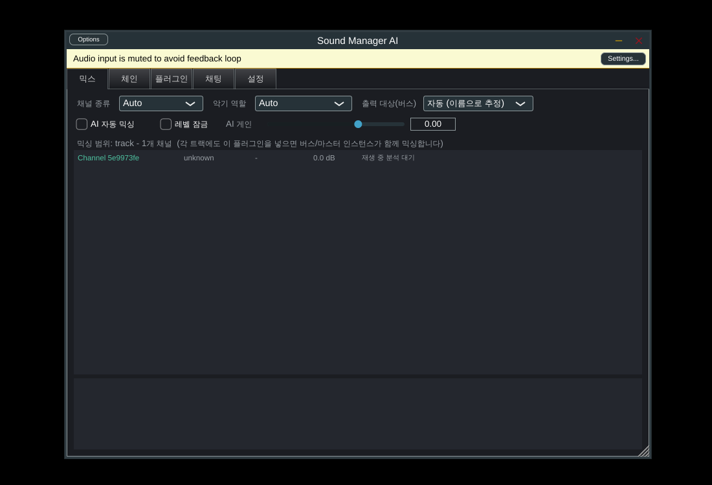

# Sound Manager AI

DAW의 트랙·버스·마스터 채널에 삽입하는 **AI 믹싱 플러그인**입니다.
사용자가 허용한 **자신의 플러그인만** 가지고, AI가 채널 소리를 듣고(분석) 플러그인 순서를 계획하고, 값과 볼륨 밸런스를 조절합니다.
"드럼의 킥이 조금 더 단단한 소리가 나면 좋겠어" 같은 채팅 요청도 그대로 플러그인 설정 변경으로 옮깁니다.



## 요구사항별 구현 방식

| # | 요구사항 | 구현 |
|---|---|---|
| 1 | 여러 DAW 지원 | JUCE 8로 **VST3**(Cubase, FL Studio, Ableton, Audacity, Reaper, Studio One), **AU**(Logic Pro), **AAX**(Pro Tools, Avid SDK 필요), **LV2**(Linux) 및 Standalone 빌드 |
| 2 | 모든 채널에 삽입 / 범위 | 인스턴스마다 채널 종류(트랙·버스·마스터)를 가집니다. 트랙에 넣으면 그 채널만, 버스에 넣으면 버스와 그 버스로 라우팅된 채널, 마스터에 넣으면 전체를 믹싱합니다. 같은 DAW 안의 인스턴스들은 `SessionHub`로 서로 연결됩니다. |
| 3 | 사용자가 체크한 플러그인만 사용 | **플러그인** 탭에서 스캔 후 체크한 플러그인만 AI 허용 목록(`PluginCatalog`)에 들어갑니다. 허용되지 않은 플러그인을 쓰는 동작은 실행기 단계에서 거부됩니다. |
| 4 | AI가 플러그인 순서 계획 | `ChainPlanner`가 역할(킥/보컬/버스/마스터…)과 분석 결과에 따라 순서를 정합니다(예: 게이트 → 감산 EQ → 디에서 → 컴프 → 트랜지언트 → 새츄레이션 → 톤 EQ → 공간계, 마스터는 리미터가 마지막). 사용자가 허용한 플러그인으로만 체인을 구성합니다. Claude는 `set_chain`으로 계획을 바꿀 수 있습니다. |
| 5 | 적용된 플러그인 자동 믹싱 | `AutoMixer`가 2초마다 듣고 → 새로 삽입된 플러그인의 초기 설정, 뚜렷한 톤 문제(탁함/쏨/부밍/치찰음/얇음) 교정, 레벨 밸런스를 작고 제한된 단계로 적용합니다. 사용자가 직접 바꾼 채널은 건드리지 않습니다. |
| 6 | 채널 볼륨 밸런스 | 각 인스턴스에 AI 게인 스테이지가 있고, `GainBalancer`가 역할별 목표 라우드니스(보컬 기준 킥 -1 LU, 하이햇 -11 LU 등)에 맞춰 조절합니다. 채널별로 "레벨 잠금"이 가능합니다. |
| 7 | 사람의 귀처럼 이해하는 채팅 | 각 채널을 BS.1770 라우드니스, 10밴드 스펙트럼, 크레스트, 트랜지언트, 스테레오 폭으로 측정하고, 이를 *muddy, harsh, thin, punchy…* 같은 지각 묘사로 바꿉니다. Claude가 이 "귀"와 플러그인 파라미터를 보고 도구 호출로 값을 바꾸며, 바꾼 뒤에는 다시 들어보고 확인합니다. API 키가 없으면 한국어/영어 규칙 기반 해석기가 대신합니다. |

## 동작 구조

```
DAW 채널 ──▶ [ Sound Manager AI 인스턴스 ]
              입력 → 사용자의 플러그인들(AI가 순서/값 결정) → AI 게인 → 분석기("귀") → 출력
                                 ▲                                   │
                                 │ MixAction (검증됨)                 │ 특징·지각 프로파일
                                 │                                   ▼
                     SessionHub (같은 DAW 안 모든 인스턴스 연결, 범위 규칙, 자동 믹스 루프)
                                 ▲
                     채팅 ──▶ Claude (도구 호출) / 오프라인 해석기
```

- **플러그인 안에서 플러그인을 호스팅**합니다. DAW 플러그인은 다른 트랙의 플러그인이나 DAW 페이더를 직접 조작할 수 없기 때문에, 사용자의 플러그인을 Sound Manager 안에 불러와 직렬로 처리합니다. 그래서 AI가 순서와 모든 파라미터를 제어할 수 있습니다.
- 서드파티 플러그인은 0~1 정규화 값만 노출합니다. `ValueMapper`는 각 파라미터의 표시 문자열("1.20 kHz", "-3.0 dB", "4.0:1")을 샘플링해 실제 단위와 정규화 값 사이의 곡선을 학습합니다. 덕분에 AI가 "Band 2를 380 Hz에서 -2.5 dB"처럼 실제 단위로 지시할 수 있습니다.
- 모든 변경은 `ActionExecutor`를 거칩니다. 범위, 허용 목록, 게인 한계(±6 dB/단계), 레벨 잠금을 검사하고 연속 파라미터는 약 300 ms에 걸쳐 부드럽게 바꿉니다.

자세한 내용은 [docs/ARCHITECTURE.md](docs/ARCHITECTURE.md)에 있습니다.

## 사용 방법

1. 믹싱에 관여시킬 **모든 트랙, 버스, 마스터**에 Sound Manager AI를 삽입합니다. 기존 플러그인 대신 첫 번째 인서트로 넣는 것을 권장합니다.
2. **플러그인** 탭에서 *플러그인 스캔* 후, AI가 써도 되는 플러그인을 체크합니다. 종류가 틀리면 우클릭으로 수정합니다.
3. **믹스** 탭에서 채널 종류·악기 역할을 확인합니다. 기본값 *Auto*는 DAW 트랙 이름으로 추정합니다. 버스로 보내는 트랙은 *출력 대상(버스)*을 지정합니다.
4. **체인** 탭의 *AI 체인 계획 적용*을 누르거나, 버스/마스터 인스턴스에서 *AI 자동 믹싱*을 켭니다.
5. **채팅** 탭에서 요청합니다.
   - "드럼의 킥이 조금 더 단단한 소리가 나면 좋겠어"
   - "보컬이 너무 쏴요"
   - "베이스를 살짝 키워줘"
   - "make the snare punchier"
6. **설정** 탭에 Anthropic API 키를 넣으면 Claude(기본 `claude-opus-5-5`)가 직접 판단합니다. 키가 없으면 오프라인 규칙 모드로 동작합니다.

> 채팅 시 전송되는 것은 **분석 수치와 플러그인 파라미터**이며 오디오 자체는 전송되지 않습니다. API 키는 사용자 설정 폴더에 평문으로 저장되며, 환경 변수 `ANTHROPIC_API_KEY`가 있으면 그것을 우선 사용합니다.

## 빌드

```bash
cmake -S . -B build -DCMAKE_BUILD_TYPE=Release
cmake --build build --config Release --parallel
ctest --test-dir build -C Release          # 코어 단위 테스트
```

- 결과물 위치: `build/plugin/SoundManager_artefacts/Release/{VST3,AU,LV2,Standalone}`
- AAX(Pro Tools): `-DSMIX_AAX_SDK_PATH=/path/to/aax-sdk`. 배포하려면 Avid 개발자 계정과 PACE 서명이 필요합니다.
- 호스팅 통합 테스트: `-DSMIX_BUILD_INTEGRATION_TEST=ON`. 테스트용 VST3 EQ/컴프레서를 빌드해 실제로 호스팅하고 채팅 요청까지 검증합니다.
- OS별 준비물, 설치 경로, CI 정보는 [docs/BUILDING.md](docs/BUILDING.md)를 참고하세요.

## 저장소 구조

```
core/      DAW·JUCE와 무관한 C++17 믹싱 엔진 (단위 테스트 포함)
  AudioAnalyzer       실시간 안전 분석기: 라우드니스, 스펙트럼, 트랜지언트, 스테레오
  PerceptualProfile   측정값을 지각 묘사로 변환 (역할별 기준 곡선)
  PluginCatalog       설치된 플러그인 목록, 종류 추정, 사용자 허용 목록
  ParamSemantics      파라미터 이름에서 역할 추정 (threshold, band 2 gain, ...)
  ValueMapper         표시 문자열을 정규화 값으로 변환하는 곡선 학습
  ChainPlanner        플러그인 순서 계획
  GainBalancer        채널 레벨 밸런스
  RecipeEngine        사운드 목표를 실제 파라미터 변경으로 변환
  LocalIntentInterpreter  한국어/영어 채팅 해석 (오프라인)
  ClaudeMixAgent      Claude Messages API 도구 루프
  AutoMixer           자동 믹스 루프
plugin/    JUCE 플러그인 (호스팅, 인스턴스 연결, UI, HTTP)
  tests/   VST3 픽스처와 호스팅 통합 테스트
docs/      설계 문서
```

## 현재 한계와 다음 단계

- **인스턴스 간 연결은 같은 프로세스 안에서만** 됩니다. 대부분의 DAW 기본 설정에서는 문제없지만, 플러그인을 별도 프로세스로 격리하는 설정(Bitwig 플러그인별 샌드박스, Logic의 일부 AU 호스팅)에서는 IPC 전송 계층이 필요합니다. 설계는 ARCHITECTURE.md에 있습니다.
- 버스 라우팅은 DAW가 플러그인에 알려주지 않습니다. 그래서 이름 기반 추정과 수동 지정을 씁니다. 오디오 상관관계 기반 자동 감지는 로드맵에 있습니다.
- 파라미터 이름이 "Param 12"처럼 의미 없는 플러그인은 역할 추정이 어렵습니다. Claude 모드에서는 이름과 표시값으로 추론하고, 오프라인 모드에서는 지원되지 않을 수 있습니다.
- AI 게인은 플러그인 내부 게인 스테이지이며 DAW 페이더를 움직이지 않습니다. DAW 자동화에는 `AI Gain` 파라미터로 노출됩니다.
- 지각 기준 곡선과 목표 라우드니스는 일반적인 믹싱 관행에서 출발한 값입니다. 레퍼런스 트랙 매칭이나 장르별 프로파일로 보정할 예정입니다.
